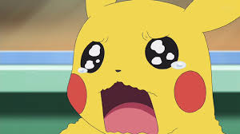
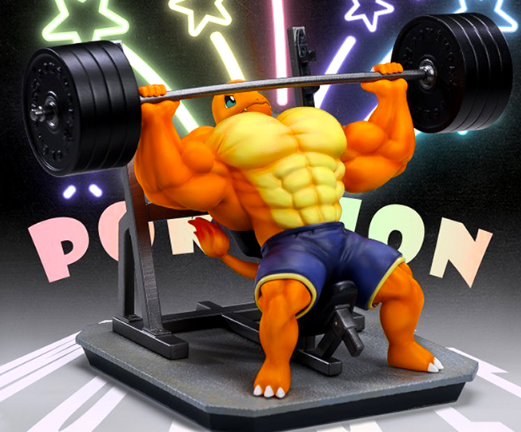

<!-- 1-Encabezados --> 
# Cabecera 1
## Cabecera 2
### Cabecera 3
<!-- 2-Formato de texto --> 
***
Este texto esta escrito en *cursiva*

Este texto esta escrito en **negrita**

Este texto esta ~~tachado~~

Este es un texto <mark>remarcado</mark>

<!-- 3-Listas --> 
***
* Desordenada item 1
	
	* Desordenada item 2
	
* Desordenada item 2

1. Ordenada1

	1.1 Macarrones 
	
2. Ordenada2

- [ ] Sacar a pasear el perro
- [x] Comprar macarrones

\ * esto es un asterisco
***
<!-- Enlaces -->
[Video de paco](https://www.youtube.com/watch?v=xS4rtfTTEqo)

[youtube](https://www.youtube.com "fiesta")

<!-- 5-Citas -->
***
>Estto es una cita 
>>Y esto es una subcita
>>>Y ahora vamos a aprender java

~~~~
System.out.prinln("Hola mundo");
~~~~ 

<!-- 6-Tablas -->
***
|Nombre	|Tipo		|Poder	|
|-------|------------|-------|
|Bulbasaur |Tierra	|154		|
|Pikachu |Electrico	|189		|
|Charmander |Fuego	|220		|

<!-- 7-Imagenes -->
***

 

<!-- 8-Emojis para GitHub -->
***

:smiley:

:sunny:

<!-- 9-Video de youtube -->
***

